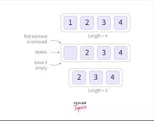
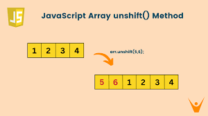
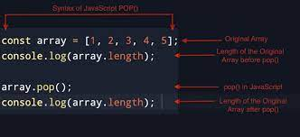
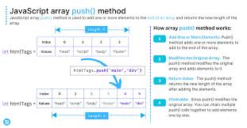
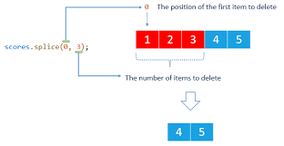
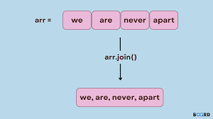
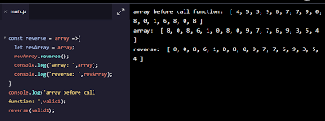
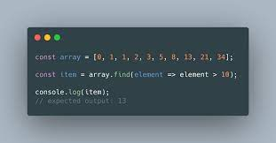
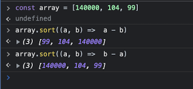

# Array (массив) чист ?
# Массив да js ин як набори аз значенияҳо ва типҳои гуногун мебошад.

## массив ба худ дарози дорад
## барои элементҳои массивро баровардан мо як цикл сар медиҳем ки индексаш аз 0 сар шуда то дарозии массив(array.length) меравад 
`for(let i=0; i<array.length){}`
## Лекин мо ҳозир барои бо массив кор кардан бе ёрии цикл кор карда метавонем. Барои бе ёрии цикл бо array кор кардан мо аз методҳо истифода мебарем. 
# Методҳои массив дар Ҷава Скрип.
## Мо дар Ҷава скрипт барои массив 18 - то метод дорем, ки онҳо ба ду гуруҳ ҷудо мешаванд: Бе калбек ва Калбекдор(callback)
 
# Методҳои бе калбэк
##  Методи shift() дар JavaScript чист?
### Методи shift() элементи якуми массивро нест мекунад. Методи shift() массиви аслиро тағир медиҳад.

## Методи unShift() дар JavaScript чист?
###  Методи unshift () барои ба аз аввали массив элементҳои нав илова кардан мебошад. Методи    unshiае() массиви аслиро иваз мекунад.

##  Методи pop() дар JavsScript чист?
### Методи pop() элементи охиринро аз массив нест мекунад ва мо агар онро ба ягон вериэйбл бахшида бошем ё онро дар кансол фарёд карда бошем у ҳамон элементи удалит кардаро нишон медиҳад. 

##  Методи push() дар JavaScript чист?
### .push() ин  методи массив дар JavaScript мебошад, ки як ё якчанд элементро ба охири массив илова мекунад ва дарозии массивро иваз мекунад.

##  Методи concat() дар JavaScript чист?
### Методи concat() барои якҷоя кардани ду ё зиёда массивҳо истифода мешавад. Ин усул массивҳои мавҷударо тағир намедиҳад, балки ба ҷои он массиви навро бармегардонад

## Metod slice() дар JavaScript чист?
### Методи slice() ин методи массив буда барои аз як ҷои массив то дигар ҷои массив баровардани элеменҳои массив мебошад.Массиви аслӣ тағир дода намешавад.

##  Metod splice() дар JavaScript чист?
### Методи splice() барои илова кардан ё хориҷ кардани элементи массиви мавҷуда истифода мешавад. синтаксиси методи splice(): splice (index, How many, ... add)

## Методи join() дар JavaScript чист?
### Методи join() ҳамаи элементҳоро дар массив бударо бо ягон элементи интихобшуда ҷудо мекунад. Синтаксис: array.join(ҷудокунанда)

##  Методи reverse () дар JavaScript чист?
### Тавсифи. Методи reverse() тартиби элементҳои якракамаро дар массив иваз мекунад. 

## Методи toReversed() дар JavaScript чист?
## Барои баръакс кардани тартиби элементҳои массив мебошад
## Методи includes() барои ёфтани ягон элемент аз даруни массив мебошад. Ва дар ҷавоб true ё false-ро бар мегардонад.
## Методи indexOf() барои ёфтани индекси ягон элемент мебошад.
## toString барои массивро ба стринг гардонидан мебошад.

# Методҳои калбэкдор
## callback чист? Ин як функсияе мебошад ки мо дар даруни метод менависем ва методҳое ки дар дарунашон мо як функсия менависем методҳои калбедор меноманд
## якум методи калбекдори массив ин методи forEach() мебошад ки ин мисли for кор мекунад. Ва минуси ин метод дар ин аст ки ин метод array - ро иваз мекунад.

## Ба мисли ин метод як методи дигар мебошад. map() Ин метод ба мисли методи пешина аст. Лекни ин метод массиви асосиро иваз намекунад.Ва ин метод return дорад яъне мо метавонем уро ба ягон тағйирёбандаи дигар бахшем

## Боз як методи дигар ин методи find() Мебошад ки он як шартро мегирад ва ба он шарте ки мо додем ягон элемент дуруст омад онро ба мо нишон медтҳад

## Ба монанди ин мо боз як методи дигар дорем ки filter() мебошад фарқи ин метод аз он дар ин аст ки ин метод ҳамаи элементҳои ба шарти мо дуруст омад нишон медиҳад.

## Методи toSorted() барои бо татиб гузоштани элеметнҳо мебошад.

